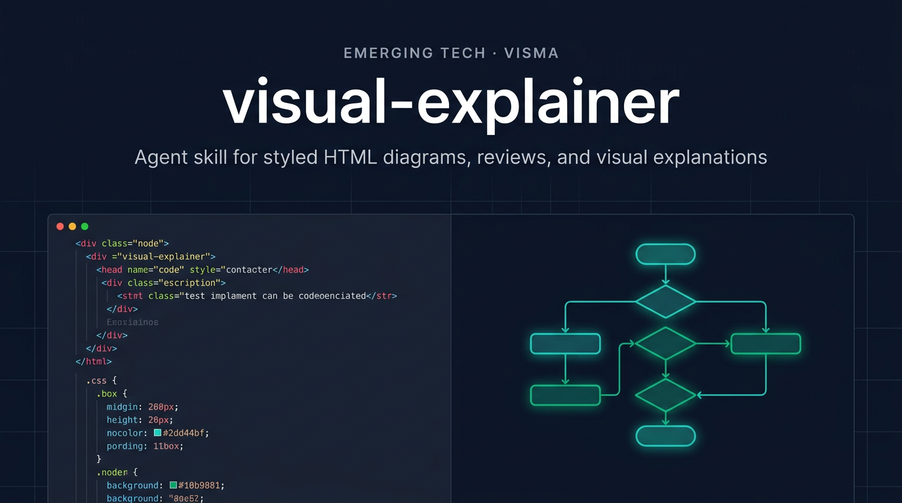

<p>
  
</p>

# visual-explainer

**An agent skill that turns complex terminal output into styled HTML pages you actually want to read.**

[](LICENSE)

Ask your agent to explain a system architecture, review a diff, or compare requirements against a plan. Instead of ASCII art and box-drawing tables, it generates a self-contained HTML page and opens it in your browser.

```
> draw a diagram of our authentication flow
> /diff-review
> /plan-review ~/docs/refactor-plan.md
```

## Why

Every coding agent defaults to ASCII art when you ask for a diagram. Box-drawing characters, monospace alignment hacks, text arrows. It works for trivial cases, but anything beyond a 3-box flowchart turns into an unreadable mess.

Tables are worse. Ask the agent to compare 15 requirements against a plan and you get a wall of pipes and dashes that wraps and breaks in the terminal. The data is there but it's painful to read.

This skill fixes that. Real typography, dark/light themes, interactive Mermaid diagrams with zoom and pan. No build step, no dependencies beyond a browser.

## Install

```bash
claude /install https://github.com/Emerging-Tech-Visma/visual-explainer
```

Commands are namespaced as `/visual-explainer:command-name`.

## Commands

| Command | What it does |
|---------|-------------|
| `/generate-web-diagram` | Generate an HTML diagram for any topic |
| `/generate-visual-plan` | Generate a visual implementation plan for a feature or extension |
| `/generate-slides` | Generate a magazine-quality slide deck |
| `/diff-review` | Visual diff review with architecture comparison and code review |
| `/plan-review` | Compare a plan against the codebase with risk assessment |
| `/project-recap` | Mental model snapshot for context-switching back to a project |
| `/fact-check` | Verify accuracy of a document against actual code |
| `/share` | Share an HTML page via GCP Firebase CLI |

## Slide Deck Mode

Any command that produces a scrollable page supports `--slides` to generate a slide deck instead:

```
/diff-review --slides
/project-recap --slides 2w
```

## How It Works

When you run a command, Claude reads the skill's design references (CSS patterns, typography, Mermaid config) and generates a self-contained HTML file. The file opens directly in your browser — no build step, no server.

The skill picks the right rendering approach automatically:
- **Mermaid** — flowcharts, sequence diagrams, class diagrams, C4 architecture
- **CSS Grid** — architecture overviews, card layouts, comparison panels
- **HTML tables** — data-heavy content, risk matrices, requirement tracking
- **Chart.js** — dashboards, KPI cards, metrics

Output goes to `~/.agent/diagrams/` and opens in your default browser.

### Auto-rendering

The skill also activates automatically when Claude is about to dump a complex table (4+ rows or 3+ columns) in the terminal — it renders HTML instead.

## Limitations

- Requires a browser to view
- Switching OS theme requires a page refresh for Mermaid SVGs
- Results vary by model capability

## Credits

Forked from [nicobailon/visual-explainer](https://github.com/nicobailon/visual-explainer). Borrows ideas from [Anthropic's frontend-design skill](https://github.com/anthropics/skills) and [interface-design](https://github.com/Dammyjay93/interface-design).

## License

MIT
